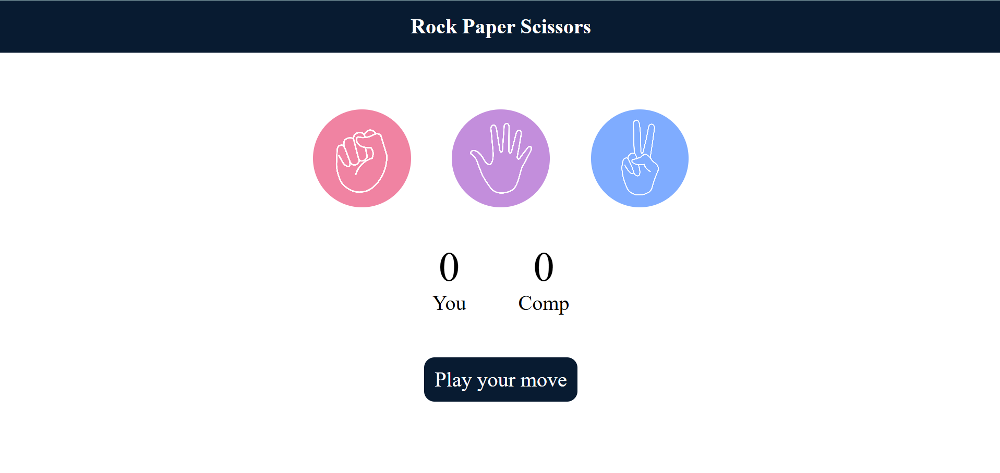

# Stone Paper Scissor

A web-based Stone Paper Scissor game developed using HTML, CSS, and JavaScript. The game allows users to play against the computer, tracks scores in real time, and displays the result of each round instantly through an interactive and responsive user interface.

## Live Demo

https://gaurav-projects07.github.io/stone-paper-scissor/

## Preview



## Features

* Play Stone Paper Scissor against the computer
* Random computer choice generation
* Real-time score tracking
* Instant win, lose, and draw results
* Interactive game icons
* Responsive and user-friendly design
* Reset and replay functionality

## Technologies Used

* HTML5
* CSS3
* JavaScript (ES6)

## Project Structure

```text
stone-paper-scissor/
│
├── images/
│   ├── stone.png
│   ├── paper.png
│   ├── scissor.png
│   └── screenshot.png
│
├── index.html
├── styles.css
├── jscode.js
└── README.md
```

## How to Run Locally

1. Clone the repository:

```bash
git clone https://github.com/gaurav-projects07/stone-paper-scissor.git
```

2. Navigate to the project directory:

```bash
cd stone-paper-scissor
```

3. Open `index.html` in your preferred web browser.

## Game Rules

1. Stone beats Scissor.
2. Scissor beats Paper.
3. Paper beats Stone.
4. If both the player and computer choose the same option, the round ends in a draw.
5. The score is updated automatically after each round.

## Future Enhancements

* Dark mode support
* Sound effects and animations
* Match history tracking
* Difficulty levels
* Multiplayer mode

## Author

Gaurav

GitHub: https://github.com/gaurav-projects07
